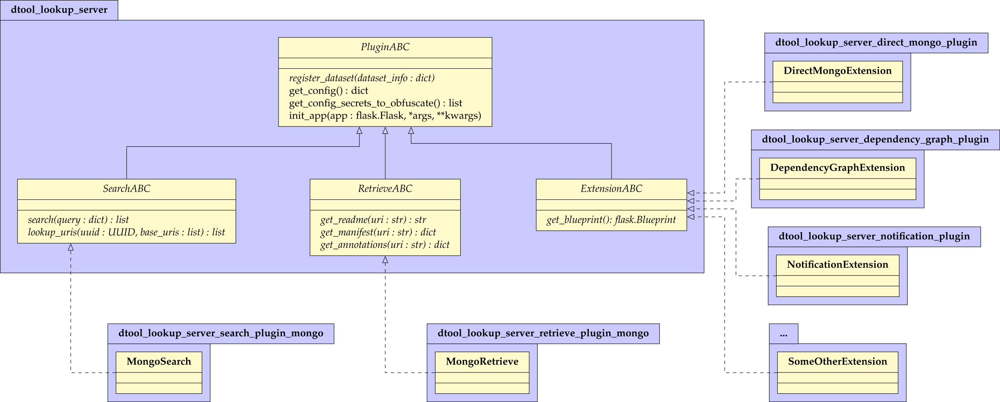

User stories that lead to *dserver*
###################################

Making a collection of *dtool* datasets searchable
--------------------------------------------------

*“As a group leader, I have started to demand the use of dtool datasets
to promote data hygiene and I require group members to archive their
datasets on infrastructure provided by my institution, such as network
shares or S3 buckets. Now, I want to keep a searchable overview on who
created what data at what time. At the minimum, I want full text search
on administrative metadata and the contents of a dataset’s README.yml.”*

This story leads to proposing *dserver. dserver* ingests datasets at
targeted base URIs and indexes them to make them searchable. What part
of the dataset is made searchable in what way should be adaptable
without much effort. At its core, *dserver* allows free text search on
administrative and descriptive metadata. Server-side plugins may extend
ingestion and search mechanisms.

Sustainability
--------------

*“As an archivist, I want dserver to evolve slowly to meet the
sustainability requirements of any long term data archive. Ideally, in a
few years from now I want to be able to interact with dserver in the
same manner as I interact with it today, irrespective of the quick
evolution of information technology in general, and irrespective of the
evolution and extension of dserver implementations specifically.”*

*dserver* needs an immutable core interface that lives on a slowly
evolving technological layer. We choose a web server that serves
HTTP/HTTPS requests. We draft a RESTful API adhering to the `OpenAPI v3
specification`_ that
defines *dserver* at its core irrespective of implementation details.
Adhering to OpenAPI specification provides a way for automatically
documenting and validating API requests both on the web interface and
the internal interfaces across *dserver.* This prevents coding errors
and provides stronger guarantees about how data is handled internally.
It also allows for encoding any further requirements at the interface
level rather than leaving it to the client side. The supplementary
information of this publication defines version 1.0 of the REST API of
*dserver*. Future implementations of *dserver* should be able to serve
older versions of the API.

A generic `unique resource identifier (URI)`_ adheres to the scheme

.. code-block::

    URI = scheme "://" authority "/" path [ "?" query ] [ "#" fragment ]

The definition of the REST API below discusses *routes* made up of the
path, query and possibly fragment components of such a URI together with
the intended HTTP methods for operating on them. In condensing the REST
API, we aim to adhere to the following fundamental concepts
:cite:p:`masse2012rest`:

* Slashes ‘/’ are used to indicate a hierarchical relationship.
* We distinguish between the *collection* and *document* resource
      archetypes, e.g. a *collection* /users and a nested *document*
      /users/hoermann
* A plural noun should be used for collection names, such as
* CRUD (create, read, update, delete) function names are not used in
      URIs. Instead, all such operations are handled by the appropriate
      HTTP method chosen from POST, GET, PUT or PATCH, and DELETE.
* The query component of a URI is used to paginate and sort collection
      results.

Roles and permissions
---------------------

*“As a group leader, I want my group members to be able to search
dserver, but I want to stay in control of who is allowed to search
what, just as I am in control of who in my group has read and write
access to which storage infrastructure. I want to have the choice to
make use of my institution’s central identity management system for
authentication.”*

*dserver* must allow simple role and permissions management. Underlying
the permission system are two types of users: *standard* and *admin*. An
*admin* user can add other users and base URIs to the system. An *admin*
user grants a *standard* user permissions to search specific base URIs
for datasets. *dserver* should be able to manage authorization itself.

*dserver* should be able to delegate authentication to an external
service.

The core REST API does not prescribe any specific authentication
mechanisms. Any API route defined below requires a successfully
authorised user unless stated otherwise. In our reference
implementation, a client application must send a JSON Web Token (JWT)
:cite:p:`jones2015json` in the authorisation
header of the HTTP request to the server. Authentication and provision
of valid JWT tokens may be handled by an external service or by
*dserver* itself via a plugin.

Users are managed through API calls directed at the *collection* /users.

A user name may contain special characters that are transformed to a
valid URL suffix {encoded_username} by percent encoding
:cite:p:`berners-lee2005uniform`.

GET /users (paginated)
~~~~~~~~~~~~~~~~~~~~~~

List the users in the *dserver* instance. The authorised user needs to
be an admin.

This route and other paginated routes below expect page and page_size as
query parameters and return pagination information in the response
headers, e.g.

.. code-block::json
    x-pagination: {
        "total": 284,
        "total_pages": 29,
        "first_page": 1,
        "last_page": 29,
        "page": 1,
        "next_page": 2
    }

GET /users/{encoded_username}
~~~~~~~~~~~~~~~~~~~~~~~~~~~~~

Return a user's information. The authorised user needs to be an admin or
the requested user themselves.

PUT /users/{encoded_username}
~~~~~~~~~~~~~~~~~~~~~~~~~~~~~~

Register or update a user with the *dserver* instance. The authorised user needs
to be an admin. The explicit registration of a new user is not enforced.
The server will implicitly treat any successfully authenticated user as
a new non-admin user without any permissions on their first interaction
with the server.

DELETE /users/{encoded_username}
~~~~~~~~~~~~~~~~~~~~~~~~~~~~~~~~

Remove a user from the *dserver* instance. This is equivalent to
removing admin status and all permissions from the user. The authorised
user needs to be admin.

Ingesting datasets
------------------

*“As a group leader, I want to delegate ingestion of datasets deposited
on certain storage infrastructure to automated discovery services.”*

*“If automatic dataset discovery occurs with a delay or is not
available, I as a researcher want to be able to trigger dataset
ingestion manually.”*

An *admin* user can grant a *standard* user permissions to register new
datasets on specific base URIs. Granted this permission, researchers may
embed dataset registration within their own workflows. Automated
services may ingest *dtool* datasets from specific storage locations
(such as SMB network shares) at given intervals, or based on signals
emitted from a storage system when new data is deposited (such as an
event notification from S3 object storage). Dataset registration should
be robust with respect to multiple registrations of the same dataset.

Base URIs and permissions on them are managed through API calls directed
at the *collection* /base_uris. Base URIs adhere to the generic scheme

.. code-block::

    {storage_broker}://{storage_endpoint_name}

where {storage_broker} is always an alphanumeric prefix like file, s3,
smb or similar, while {storage_endpoint_name} may contain slashes (’/’)
or other special characters. This bijectively translates to the valid
URL suffix

.. code-block::

    {encoded_base_uri} = {storage_broker}/{encoded_storage_endpoint_name}

where {encoded_storage_endpoint_name} is the percent-encoded
:cite:p:`berners-lee2005uniform` {storage_endpoint_name}
with slashes (’/’) exempt from encoding.

GET /base_uris (paginated)
~~~~~~~~~~~~~~~~~~~~~~~~~~

List all base URIs. The user needs to be an admin.

GET /base_uris/{encoded_base_uri}
~~~~~~~~~~~~~~~~~~~~~~~~~~~~~~~~~

Get information about the permissions on a base URI. The user needs to
be an admin.

PUT /base_uris/{encoded_base_uri}
~~~~~~~~~~~~~~~~~~~~~~~~~~~~~~~~~

Register or update a base URI with the permissions specified in the
request body. The authorised user needs to be an admin.

DELETE /base_uris/{encoded_base_uri}
~~~~~~~~~~~~~~~~~~~~~~~~~~~~~~~~~~~~

Delete a base URI from the server.

Overview on numbers
-------------------

*“As a researcher. I want to see a simple statistical summary on the
numbers of registered datasets I have access to.”*

*“As a group leader, I want to be able to retrieve a summary of base
URIs, users and datasets registered in the system.”*

As a consequence, *dserver* will exhibit a route to retrieve an overview
on all base URIs, all creators, all tags, the total number of datasets
and the count of datasets per base URI, per creator, and per tag.

GET /users/{encoded_username}/summary
~~~~~~~~~~~~~~~~~~~~~~~~~~~~~~~~~~~~~

Global summary of the datasets a user has access to. The authorised user
needs to be an admin or the requested user themselves.

Finding datasets
----------------

*“As a group leader, I want to retrieve a list of all registered
datasets for bookkeeping.”*

*“As a researcher, I want to retrieve a list of all registered datasets
I have access to.”*

*“As a researcher, I want to search through all datasets by keywords.
Sometimes, I want to search only a subset of registered dataset by
creators, base URIS, tags or UUIDs.”*

As a consequence, *dserver* will provide a route to list all datasets
and filter the results by free text search, creators, base URIS, tags or
UUIDs.

The core schema of all dataset-centred operations is the *Dataset,*
comprising at least all fields within this example:

.. code-block::json
   {
       "base_uri": "smb://test-share",
       "created_at": 1604860720.736269,
       "creator_username": "jotelha",
       "frozen_at": 1604864525.691079,
       "name": "simple_test_dataset",
       "number_of_items": 1,
       "size_in_bytes": 17,
       "uri": "smb://test-share/1a1-[...]-675",
       "uuid": "1a1f9fad-8589-413e-9602-5bbd66bfe675"
    }

All operations that returns a list of such datasets and marked as
*sorted* may return results in alphanumerically ascending (+) or
descending (-) order by any combination of these minimum set of fields
provided via the query parameter *sort* in a comma-separated list and
prefixed by plus or minus signs, e.g.

.. code-block::

    ?sort=+base_uri,-created_at

Dataset entries in the index are managed through API calls located at
the prefix /uris.

Full dataset URIs adhere to the generic scheme

.. code-block::

    {storage_broker}://{storage_endpoint_name}/{dataset_identifier}

where {storage_broker} is always an alphanumeric prefix like file, s3,
smb or similar, while {storage_endpoint_name} may contain slashes (’/’)
or other special characters. The {dataset_identifier} does not contain
slashes (’/’), but might contain other special characters. This
bijectively translates to the valid URL suffix

.. code-block::

    {encoded_uri} = {storage_broker}/{encoded_storage_endpoint_name}/{encoded_dataset_identifier}

where {encoded_dataset_identifier} is the percent-encoded
`[9] <https://paperpile.com/c/s8ZTYM/9gBV>`__ {dataset_identifier} and
{encoded_storage_endpoint_name} is the percent-encoded
{storage_endpoint_name}, latter with slashes (’/’) exempt from encoding.

GET /uris (paginated, sorted)
~~~~~~~~~~~~~~~~~~~~~~~~~~~~~

.. code-block::

    GET /uris ?
        [ free_text = encoded free text ]
        [ & base_uri = percent-encoded base URI, may be used repeatedly ]
        [ & creator_username = percent-encoded username, may be used repeatedly ]
        [ & uuid = UUID, may be used repeatedly ]
        [ & tag = percent-encoded tag, may be used repeatedly ]

List datasets the user has access to matching the query.

POST /uris (paginated, sorted)
~~~~~~~~~~~~~~~~~~~~~~~~~~~~~~

List datasets the user has access to matching the query. Other than
above, the query is submitted as a JSON document in the request body.

GET /uris/{encoded_uri}
~~~~~~~~~~~~~~~~~~~~~~~

Get the specific entry for a localised dataset instance.

PUT /uris/{encoded_uri}
~~~~~~~~~~~~~~~~~~~~~~~

Register or update a dataset. The user needs to have register permissions on the
base_uri.

DELETE /uris/{encoded_uri}
~~~~~~~~~~~~~~~~~~~~~~~~~~

Remove a dataset from the *dserver* instance. The user needs to have
register permissions on the base URI.

Accessing dataset information grouped by UUID
---------------------------------------------

*“As a researcher, I note dataset UUIDs as references to datasets in
presentation slides, annotated manuscripts, commented analysis
workflows, … as a simple way of provenance tracking. Consequently, I
want to find any dataset quickly by UUID.”*

As a consequence, *dserver* will provide a route to access dataset
instance URIs grouped by UUID.

Dataset entries in the index can be queried grouped by UUID through API
calls located at the prefix /uuids.

GET /uuids/{uuid} (paginated)
~~~~~~~~~~~~~~~~~~~~~~~~~~~~~

List all instances of a dataset in any base URIs the user has access to.

DELETE /uuids/{uuid}
~~~~~~~~~~~~~~~~~~~~

Remove all instances of a dataset the user has access to from the
*dserver* instance. The user needs to have register permissions for the
respective base URIs.

Retrieving a dataset’s manifest, readme and annotations
-------------------------------------------------------

*“As a researcher, I want to quickly retrieve file names and sizes of an
ingested dataset.”*

*“As a researcher, I want to quickly retrieve the metadata, meaning the
content of an registered dataset’s README.yml., avoiding the detour of
accessing the actual dataset on the respective storage infrastructure
directly via dtool.”*

*“As a researcher, I want to quickly retrieve tags and annotations of a
registered dataset.”*

*dserver* stores *manifest, readme* and *annotations* in a quickly
accessible database next to basic administrative metadata, avoiding the
detour of accessing the actual dataset on the respective storage
infrastructure directly via *dtool*. Structural and descriptive metadata
of a dataset in the index can be queried through API calls located at
the prefix /retrieve.

GET /manifests/{encoded_uri}
~~~~~~~~~~~~~~~~~~~~~~~~~~~~

Request the dataset manifest.

GET /readmes/{encoded_uri}
~~~~~~~~~~~~~~~~~~~~~~~~~~

Request the dataset readme.

GET /annotations/{encoded_uri}
~~~~~~~~~~~~~~~~~~~~~~~~~~~~~~

Request the dataset annotations.

GET /tags/{encoded_uri}
~~~~~~~~~~~~~~~~~~~~~~~~~~~~~~

Request the dataset tags.

Retrieving server-side configuration
------------------------------------

*“As a consumer of dserver I want to be able to create clients that
auto-discover the API. To be able to talk with the server properly, I
need knowledge about the availability of server extensions, server and
extensions versions, and server-side configuration. This allows me to
dynamically extend the server’s API in a sustainable manner, leaving the
core API defined here untouched.”*

As a consequence, the server will offer information on the server and
plugin versions on a route that does not require authorization. Specific
configuration parameters are provided to the client at another route
that requires authorization. Each plugin decides itself which of its
configuration parameters are exposed to the client via this route. The
following two routes provide information on server-side configuration
and versions.

GET /config/info
~~~~~~~~~~~~~~~~

Return the JSON-serialised Flask app configuration.

GET /config/versions (accessible without authorization)
~~~~~~~~~~~~~~~~~~~~~~~~~~~~~~~~~~~~~~~~~~~~~~~~~~~~~~~

Return the JSON-serialised server component versions.

User stories that lead to the design of our *dserver* implementation
####################################################################

Modular design
--------------

*“As a software engineer tasked with making a cloud native
implementation of dserver I want to be able to swap out any components
that rely on databases so that I can make my own plug-ins that use cloud
databases to replace these components.”*

As a consequence of this user story, we split our minimal *dserver*
implementation into three components: the core application, the search
plugin and the retrieve plugin. Conceptually, the core application
exposes the consumable interface and manages privileges in a core
database. The search plugin takes responsibility for building a
searchable index of registered datasets. For this purpose, it may
maintain its own database. The decision on which information is made
searchable in what way lies with the specific search plugin
implementation. The retrieve plugin takes responsibility for delivering
metadata such as readme, manifest, or annotations for registered
datasets efficiently on demand and may maintain its own database as
well. Beyond these three core components, *dserver* should support
arbitrary plugins that provide extended functionality, usually by
introducing additional REST API routes.

Language and framework
----------------------

*“As a DevOps engineer tasked with installing and maintaining a dserver
I want to be able to configure it to run in a way that is consistent
with my other production systems to keep my tool chain as lean and
consistent as possible. dserver should therefore not have strong
opinions on things like systemd, docker, kubernetes, etc. Rather it
should be able to fit into any of these systems.”*

This user story leads to the choice of framework, and therefore enforces
the choice of language at this point. *dserver* and its plugins are
implemented in Python. Python serves as a suitable glue language for
creating a web API that can talk to a variety of databases. Furthermore,
it is a popular language with many scientists. It renders the framework
straightforward to extend for scientists with only moderate code
development knowledge. Ultimately, leveraging the Python-implemented
*dtoolcore* API at the server’s heart dictates the language choice. For
a lean implementation via Python’s web server gateway interface (WSGI) :cite:p:`pep3333`, we choose `Flask`_ as the web application framework and
`flask-smorest`_ as REST API framework for OpenAPI specification
auto generation and pagination. Authorisation is handled by
`flask-jwt-extended`_. The
generation of JSON Web Token (JWT) tokens can be easily delegated to
external microservices to authenticate against.

Abstract base classes
---------------------

*“As a software engineer tasked with extending dserver with new
functionality I want to be able to develop my own package that plugs
into the system without having to touch any of the code used to run the
base installation of dserver, and I want to have access to abstract base
classes to inherit from to help guide my development efforts.”*

We realise the modular plugin structure described above with `Python
entry points`_. Search and retrieve plugins as well as any other
custom extension to the server must adhere to abstract base classes
(ABC) provided by the core application. These abstract base classes
prescribe a minimal set of virtual methods that plugins must implement.
The Unified Modeling Language (UML) class diagram in :ref:`Fig. 1 <fig>` illustrates
this design. The application-central *PluginABC* and its children
*SearchABC, RetrieveABC* and *ExtensionABC* are used to guide the
development of external plugin packages. Importantly, any plugin must
provide a method *register_dataset(...)* that serves as a hook for
informing about freshly ingested datasets. This plugin architecture
alleviates the need to modify the core code when introducing new
features and facilitates extending *dserver* for niche use cases with
tailor-made plugins.

.. _fig:

Figure 1: UML diagram of abstract base classes in the
*dtool-lookup-server* Python package and a few examples of plugin
implementations in other packages. Adhering to UML notation conventions,
tabbed frames define modules. Classes are blocks of three stacked
segments: class name, attributes, and methods. Virtual methods are
typeset in italic font. Solid arrows indicate inheritance. Dashed arrows
indicate implementation of an abstract interface. Importantly, every
plugin must implement a register_dataset method to be evoked by the core
app on ingestion of a new dataset. Furthermore, a search plugin must
provide a search method and a retrieve plugin must provide methods for
retrieving readme, manifest and annotations for a dataset. Examples of
plugins shown in this diagram are introduced briefly in the
supplementary information and find application in practical applications
of *dserver* discussed below.

.. _OpenAPI v3 specification: https://spec.openapis.org/oas/v3.1.0
.. _unique resource identifier (URI): https://en.wikipedia.org/wiki/Uniform_Resource_Identifier
.. _Flask: https://flask.palletsprojects.com/en/3.0.x/
.. _flask-smorest: https://flask-smorest.readthedocs.io/en/latest/
.. _flask-jwt-extended: https://flask-jwt-extended.readthedocs.io/en/stable/
.. _Python entry points: https://packaging.python.org/en/latest/specifications/entry-points/